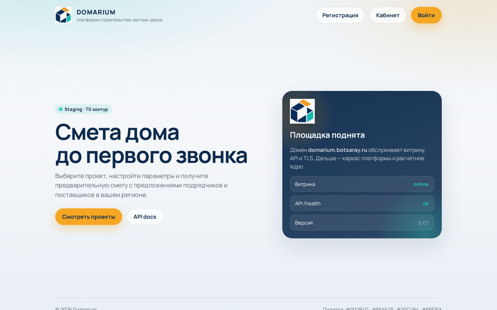
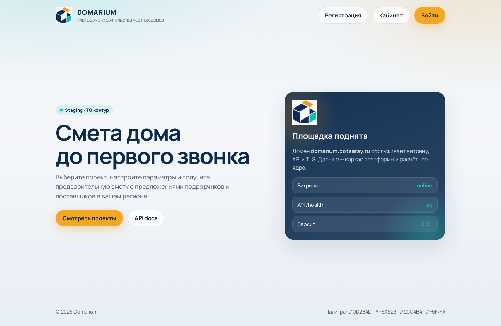
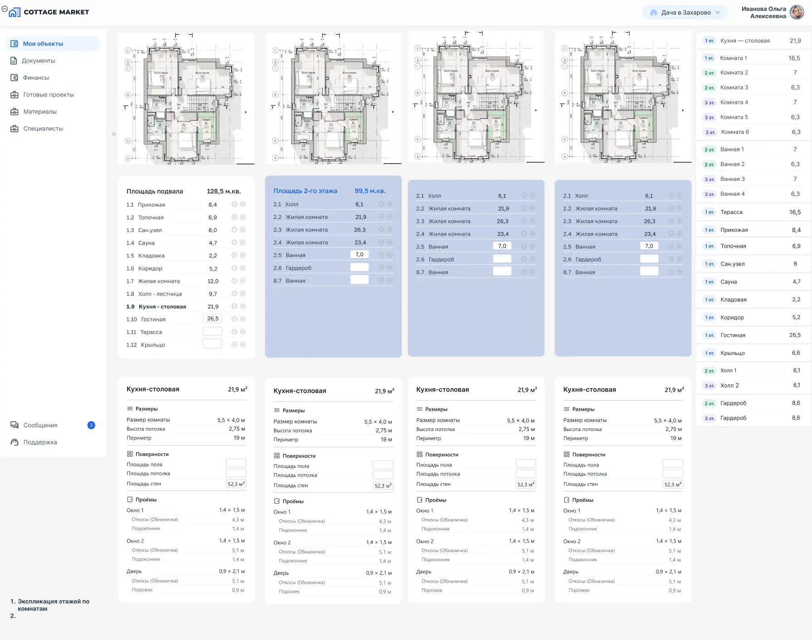
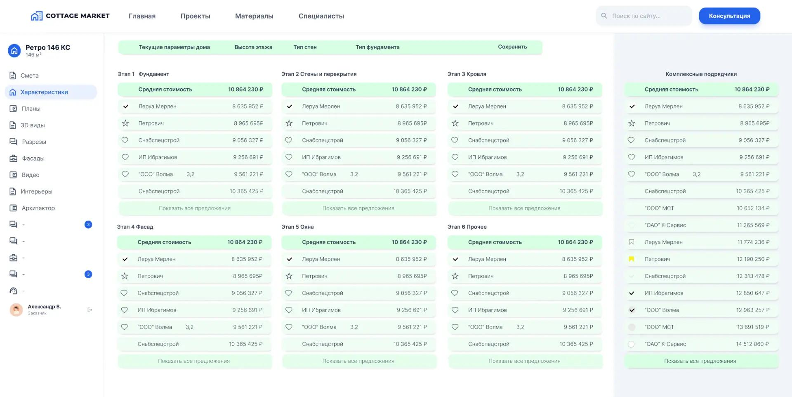
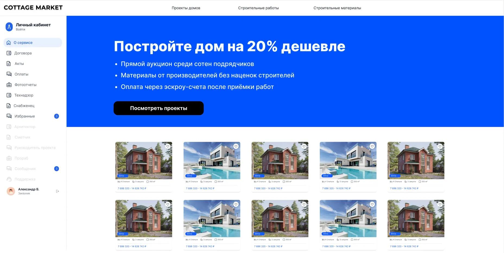

# Domarium

> **Чтобы приобрести данный софт обращайтесь по адресу itshumakher@ g m a il.com**

**Domarium** — маркетплейс строительства дома и расчёта сметы. Продукт рассчитан на заказчики строительства, проектировщики и подрядчики и превращает параметры будущего дома в структурированное предложение и понятную смету.

- Публичный адрес: https://domarium.botsaray.ru/
- Основные сущности: проекты, помещения, характеристики, этапы, позиции сметы, предложения и подрядчики.
- Ключевые возможности: параметры дома, детализация помещений, характеристики этапов, сметный расчёт, каталог решений, сравнение предложений и пояснение состава стоимости.

## Зачем нужен продукт

Рабочий процесс редко состоит из одного действия. Пользователю приходится понимать исходную ситуацию, собирать сведения, выбирать следующий шаг, согласовывать решение и возвращаться к результату позже. Domarium создаёт для этого единое предметное пространство. Оно помогает не терять контекст между этапами и видеть не только отдельную карточку, но и её место в общем процессе.

Главная ценность продукта — не количество экранов, а связность работы. Проекты, помещения, характеристики, этапы, позиции сметы, предложения и подрядчики рассматриваются как части одного пользовательского маршрута. Благодаря этому новый участник быстрее понимает состояние дела, опытный специалист тратит меньше времени на ручное сопоставление, а руководитель получает обозримую картину без пересказа каждого шага.

## Что получает пользователь

### Понятную точку входа

Первый экран помогает определить назначение сервиса, найти нужный раздел и продолжить незавершённую работу. Термины привязаны к предметной области, а основные действия сгруппированы по пользовательской цели. Интерфейс не требует знания внутреннего устройства продукта.

### Последовательный рабочий маршрут

Пользователь движется от обзора к конкретному объекту, затем к действию и проверке результата. Связанные сведения остаются рядом: можно понять, откуда возникла задача, кто участвует, что уже сделано и какой итог ожидается. Такой маршрут полезен и для единичной операции, и для регулярно повторяющегося процесса.

### Наблюдаемое состояние

Статусы, списки и карточки отвечают на практические вопросы: что доступно сейчас, что требует внимания, где ожидается решение и что уже завершено. Наблюдаемость снижает зависимость от устных уточнений и разрозненных заметок. Она не заменяет профессиональное решение, но даёт опору для него.

### Общий язык для участников

Роли Заказчик, Специалист по расчёту и Подрядчик работают с одной предметной моделью, хотя видят её с разных сторон. Единые названия объектов и состояний уменьшают двусмысленность при передаче работы. Ответственный участник может сослаться на конкретный объект и ожидаемый результат, а не пересказывать весь контекст.

## Основные разделы

Публичное описание охватывает следующие пользовательские возможности:

- **Параметры дома** — отдельный аспект работы, связанный с общей моделью продукта и понятным результатом для пользователя.
- **Детализация помещений** — отдельный аспект работы, связанный с общей моделью продукта и понятным результатом для пользователя.
- **Характеристики этапов** — отдельный аспект работы, связанный с общей моделью продукта и понятным результатом для пользователя.
- **Сметный расчёт** — отдельный аспект работы, связанный с общей моделью продукта и понятным результатом для пользователя.
- **Каталог решений** — отдельный аспект работы, связанный с общей моделью продукта и понятным результатом для пользователя.
- **Сравнение предложений** — отдельный аспект работы, связанный с общей моделью продукта и понятным результатом для пользователя.
- **Пояснение состава стоимости** — отдельный аспект работы, связанный с общей моделью продукта и понятным результатом для пользователя.

Подробная расшифровка разделов, ролей и сквозных потоков находится в документе «Возможности». Практические ситуации собраны в «Сценариях», а короткие ответы на вопросы — в разделе FAQ.

## Для кого

### Заказчик

Получает быстрый обзор, начинает основной сценарий и видит результат в терминах своей задачи. Для этой роли важны ясная навигация, предсказуемые состояния и возможность вернуться к ранее начатой работе.

### Специалист по расчёту

Работает с предметными деталями, уточняет сведения и продвигает объект по процессу. Интерфейс помогает удерживать контекст и отличать фактические данные от промежуточного решения.

### Подрядчик

Смотрит на полноту, согласованность и итог. Роль получает основу для проверки, приоритизации и передачи следующему участнику, не вмешиваясь в скрытые технические механизмы.

## Принципы пользовательского опыта

1. **Предметность.** На экране используются понятия из реальной задачи, а не устройство программной системы.
2. **Связность.** Карточки, списки и статусы образуют маршрут, а не набор несвязанных страниц.
3. **Проверяемость.** После значимого действия пользователь видит изменившееся состояние или явный результат.
4. **Ролевой фокус.** Каждая роль начинает с тех сведений, которые нужны ей для следующего решения.
5. **Бережное ожидание.** Если результат зависит от другого участника, интерфейс показывает это как отдельное состояние.
6. **Честные границы.** Публичная документация не обещает функции, которые нельзя подтвердить назначением продукта.

## Как начать знакомство

1. Откройте публичный адрес и ознакомьтесь с назначением продукта.
2. Определите свою роль и предметный объект, с которым предстоит работать.
3. Перейдите от общего обзора к нужному разделу.
4. Проверьте исходные сведения и доступные действия.
5. Выполните один законченный сценарий и убедитесь, что результат отражён в состоянии объекта.
6. Используйте подробные материалы репозитория для знакомства с остальными возможностями.

## Границы публичного описания

Репозиторий описывает продукт с точки зрения пользователя: задачи, роли, экраны, понятия и ожидаемые результаты. Он не является эксплуатационной инструкцией, юридическим заключением или обещанием неизменности интерфейса. Состав доступных действий может зависеть от роли, редакции продукта и условий конкретного использования.

## Дополнительные материалы

- [Возможности (подробно)](docs/FEATURES.md)
- [Сценарии](docs/USE_CASES.md)
- [FAQ](docs/FAQ.md)
- [Паспорт продукта](docs/DATASET.md)

## Скриншоты интерфейса

### Domarium home

### Domarium home full

### 01 detalizaciya pomeshchenij

### 02 harakteristiki i smeta etapov

### 03 katalog i o servise

---

## Публичная оговорка

Этот репозиторий содержит **только пользовательское и маркетинговое описание** продукта.  
Исходный код, ключи, конфигурации инфраструктуры, прокси, антибан-политики и внутренние регламенты **не публикуются**.

© AiSaray / Edwaks, 2026
